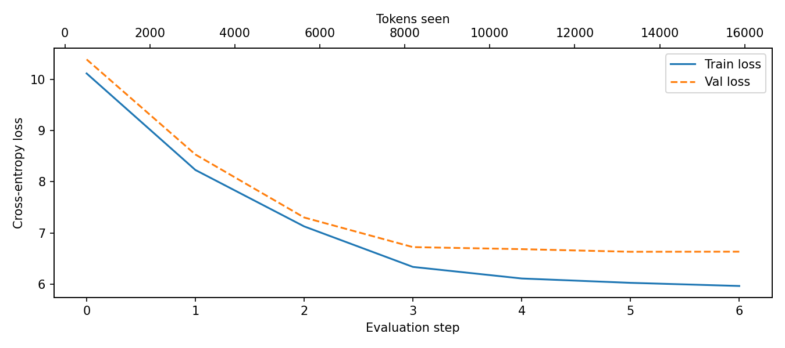
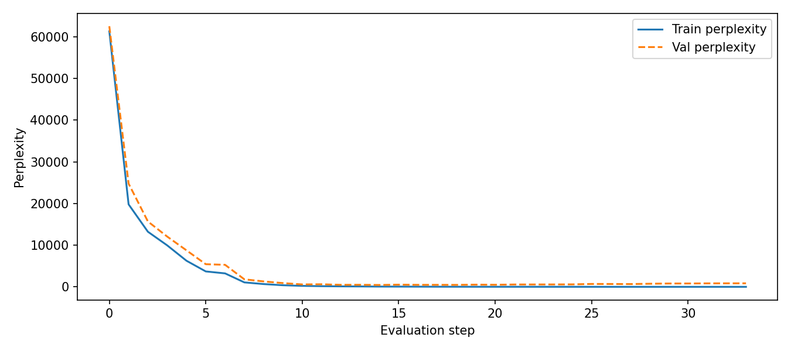

# GPT-2 Implementation

A GPT-2 (124M) implementation from scratch in PyTorch, with MLflow experiment tracking, scalable training techniques, and attention visualisation support.

## Setup

```bash
pip install -r requirements.txt
```

## Usage

### Training

```bash
python train.py                        # downloads dataset, trains for 10 epochs
python train.py --epochs 5             # custom epoch count
python train.py --lr 3e-4              # custom learning rate
python train.py --batch-size 4         # custom batch size
python train.py --data my_text.txt     # use your own text file
```

### Viewing results in MLflow

```bash
mlflow ui --backend-store-uri sqlite:///mlflow.db
# Open http://localhost:5000
```

MLflow tracks per-step metrics and saves artefacts for every run:

| Logged metrics | Saved artefacts |
|---|---|
| `train_loss`, `val_loss` | Loss curve plot |
| `train_perplexity`, `val_perplexity` | Perplexity curve plot |
| `grad_norm` | Gradient norm plot (with clip threshold) |
| `tokens_seen` | LR schedule plot (warmup + cosine decay) |
| | Model weights (`.pt`) |

## Project Structure

```
GPT2Implementation/
├── gpt2/
│   ├── config.py       # GPT_CONFIG_124M
│   ├── layers.py       # LayerNorm, GELU, FeedForward (4× expansion)
│   ├── attention.py    # MultiHeadAttention (+ return_attn_weights)
│   ├── transformer.py  # TransformerBlock
│   ├── model.py        # GPTModel (scaled weight init)
│   ├── data.py         # GPTDataset, create_dataloader
│   ├── training.py     # train_model_simple, evaluate_model, generate
│   └── __init__.py
├── train.py            # Training entry point with MLflow integration
└── requirements.txt
```

## Model

Default config (`GPT_CONFIG_124M`) matches GPT-2 small:

| Parameter       | Value   |
|----------------|---------|
| Parameters      | ~124M   |
| Vocab size      | 50,257  |
| Context length  | 1,024   |
| Embedding dim   | 768     |
| Attention heads | 12      |
| Layers          | 12      |
| FFN expansion   | 4×      |
| Dropout         | 0.1     |

## Training techniques implemented

| Technique | Location | Notes |
|---|---|---|
| Scaled weight init | `gpt2/model.py` | N(0, 0.02); residual projections scaled by `1/√(2·N)` |
| Weight decay param groups | `train.py` | Decay matrices (ndim ≥ 2); no decay on biases/norms |
| AdamW betas | `train.py` | `(0.9, 0.95)` per GPT-2 paper |
| Gradient clipping | `gpt2/training.py` | `clip_grad_norm_(..., max_norm=1.0)` |
| Gradient accumulation | `gpt2/training.py` | Configurable via `accumulation_steps` |
| LR warmup + cosine decay | `train.py` + `gpt2/training.py` | Linear warmup → cosine to 0 |

## Training details

- **Dataset:** any plain text file; defaults to *The Verdict* (Edith Wharton, public domain)
- **Objective:** next-token prediction (cross-entropy loss)
- **Tokeniser:** tiktoken BPE (`gpt2` encoding, 50,257 tokens)
- **Effective batch size:** `batch_size × accumulation_steps`

## Results



